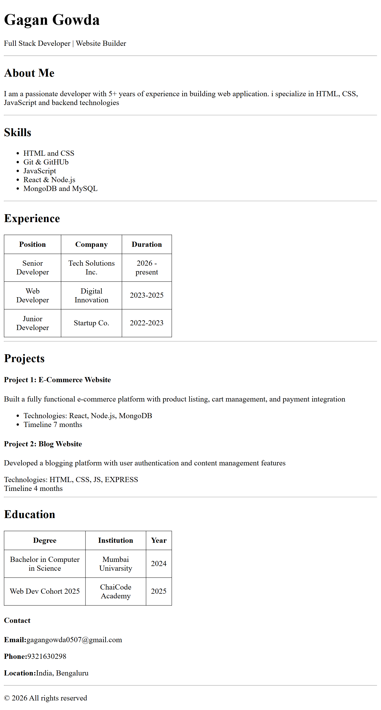

# Resume
## 📸 Screenshot



# Demo Video

<video src="c:\Users\gowda\Videos\ScreenRecorderFiles\20260128\04-55-19.mp4" controls></video>


# Resume Page (HTML Only)

This project is a **simple resume webpage built using pure HTML**.  
It is beginner-friendly and created as part of my **Web Development learning journey (Cohort 2026)**.

---

## 📌 Tech Stack
- HTML5

---

## 🚀 Setup Instructions

Follow the steps below to run this project locally:

1. **Clone the repository**
   ```bash
   git clone https://github.com/codewgagan/Resume.git
